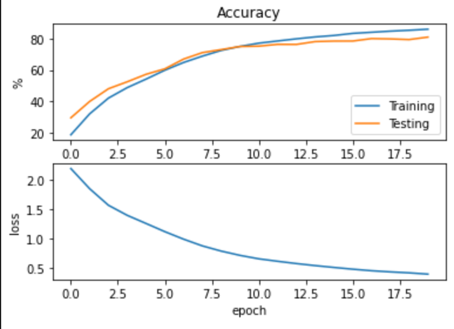

# Recognizing Cifar10 using All-CNN / VGG16

## Requirements
- Python 3 64-bit
- Dependency
	```
	tkinter tensorflow matplotlib numpy
	```

## Usage
run:
```
python cnn.py
```

## Result


## 心得
- VGG16 因為 weight 太多（224x224），不太適合拿來套在 Cifar10（32x32）
- 用 VGG16 訓練一開始（或我有跑過的次數），Accuracy 結果都趨近於0.1（隨便亂猜的意思）
- Colab 可以用 GPU 加速！！

## Reference
- [Convolutional Neural Network (CNN)](https://www.tensorflow.org/tutorials/images/cnn)
- [Densely Connected Convolutional Networks](https://arxiv.org/pdf/1608.06993.pdf)
  - Not used
  - Found the following reference
- [STRIVING FOR SIMPLICITY: THE ALL CONVOLUTIONAL NET](https://arxiv.org/pdf/1412.6806.pdf)
  - Use the All-CNN-C Model
  - [All-CNN](https://github.com/PAN001/All-CNN)
- [python - 使用子类模型时，model.summary()无法打印输出形状](https://www.coder.work/article/1258695)